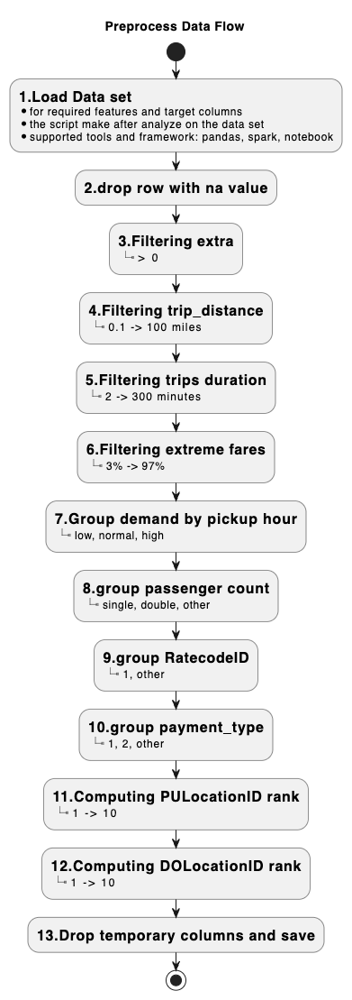

# DSA5208_Project1

python -m venv venv

source venv/bin/activate

pip install -r requirements.txt


mpiexec -n 4 python MPI_SGD_NN_train.py --data sample_data/nytaxi2022_1000.csv --epochs 30 --batch-size 128 --hidden 64 --lr 0.01 --activation relu

## good result (Best)
mpiexec -n 4 python MPI_SGD_NN_train.py --data sample_data/nytaxi2022_100000.csv --epochs 5 --batch-size 128 --hidden 64 --lr 0.001 --activation relu


mpiexec -n 4 python MPI_SGD_NN_train.py --data sample_data/nytaxi2022_100000.csv --epochs 30 --batch-size 128 --hidden 64 --lr 0.01 --activation relu
## learn slower -> have same result
mpiexec -n 4 python MPI_SGD_NN_train.py --data sample_data/nytaxi2022_100000.csv --epochs 30 --batch-size 128 --hidden 64 --lr 0.001 --activation relu

mpiexec -n 4 python main.py --data sample_data/nytaxi2022_100000.csv --epochs 30 --batch-size 128 --hidden 64 --lr 0.001 --activation relu

mpiexec -n 4 python MPI_SGD_NN_train.py --data sample_data/nytaxi2022_1000000.csv --epochs 30 --batch-size 128 --hidden 64 --lr 0.001 --activation relu

mpiexec -n 4 python MPI_SGD_NN_train.py --data sample_data/nytaxi2022_1000000.csv --epochs 30 --batch-size 128 --hidden 64 --lr 0.001 --activation relu


mpiexec -n 4 python MPI_SGD_NN_train.py --data sample_data/nytaxi2022_1000000.csv --epochs 10 --batch-size 512 --hidden 128 --lr 0.005 --activation relu

### Make OS down !!!!!
mpiexec -n 4 python MPI_SGD_NN_train.py --data sample_data/nytaxi2022.csv --epochs 10 --batch-size 512 --hidden 128 --lr 0.001 --activation relu


### 5000000 Slow
mpiexec -n 4 python MPI_SGD_NN_train.py --data sample_data/nytaxi2022_5000000.csv --epochs 30 --batch-size 256 --hidden 64 --lr 0.002 --activation relu


### Good running with 5_000_000 rows ========Training Loop===== took 51.1316 sec
mpiexec -n 4 python MPI_SGD_NN_train.py --data sample_data/nytaxi2022_5000000.csv --epochs 15 --batch-size 1024 --hidden 64 --lr 0.002 --activation relu

mpiexec -n 4 python MPI_SGD_NN_train.py --data sample_data/nytaxi2022_1_000_000.csv --epochs 15 --batch-size 1024 --hidden 64 --lr 0.002 --activation relu

### 5_000_000 rows ========Training Loop===== took 45.7661 sec
mpiexec -n 8 python MPI_SGD_NN_train.py --data sample_data/nytaxi2022_5000000.csv --epochs 15 --batch-size 1024 --hidden 64 --lr 0.002 --activation relu

### 5_000_000 rows ========Training Loop===== took 31.3852 sec
mpiexec -n 8 python MPI_SGD_NN_train.py --data sample_data/nytaxi2022_5000000.csv --epochs 10 --batch-size 1024 --hidden 64 --lr 0.002 --activation relu

### 10_000_000 rows ========Training Loop===== took 55.3736 sec
mpiexec -n 8 python MPI_SGD_NN_train.py --data sample_data/nytaxi2022_10_000_000.csv --epochs 10 --batch-size 1024 --hidden 64 --lr 0.002 --activation relu


mpiexec -n 4 python MPI_SGD_NN_train.py --data sample_data/nytaxi2022.csv --epochs 15 --batch-size 1024 --hidden 64 --lr 0.002 --activation relu

--epochs 300 ==> Cham qua khong chiu noi

## Have to install library for macbook M2

sudo chown -R XuanNguyen /opt/homebrew

brew install open-mpi

## How to filter the invalid data ?
1. negative data
2. random data

```
'tpep_pickup_datetime' => simplify ==> minutes: <0, ... <300(5 hours), 000
'tpep_dropoff_datetime'
'passenger_count' -> Number descrete: 1, 2, other
'trip_distance' -> Number Liner
'RatecodeID' -> Number descrete: 1, other
'PULocationID' -> frequency: 10%, .., 90%
'DOLocationID' -> frequency
'payment_type' -> Number descrete: 1,2, other
'extra' -> Number Liner
```


export MY_PYTHON=/Users/XuanNguyen/Documents/NUS/DSA5208/DSA5208_Project1/venv/bin/python3


### Working
2025-09-19 18:59:22,288 - INFO - [Rank 0] ========Training Loop===== took 73.4590 sec
mpiexec -n 4 python MPI_SGD_NN_train.py --data sample_data/cleaned_data_10_000_000.csv --epochs 5 --batch-size 1024 --hidden 64 --lr 0.002 --activation relu


mpiexec -n 4 python MPI_SGD_NN_train.py --data sample_data/cleaned_data_v4.csv --epochs 5 --batch-size 1024 --hidden 64 --lr 0.002 --activation relu