# Project 1 — Distributed Training on NYC Taxi (MPI)

**Course:** DSS5208 – Scalable Distributed Computing for Data Science  
**Goal:** Train a 1-hidden-layer neural network on NYC taxi data using **MPI (mpi4py)**.  
We run three activation functions σ and at five batch sizes M, log training histories, report RMSE on train/test, and training Times for different number of processes 
Data are stored **nearly evenly** across processes via memory-mapped shards.

## 1) Data & Preprocessing

- **Raw:** `nytaxi2022.csv` (not tracked in Git).
- **Cleaned:** `nytaxi2022_cleaned.csv`

Preprocess activities to cleanup and remove outliner from dataset:
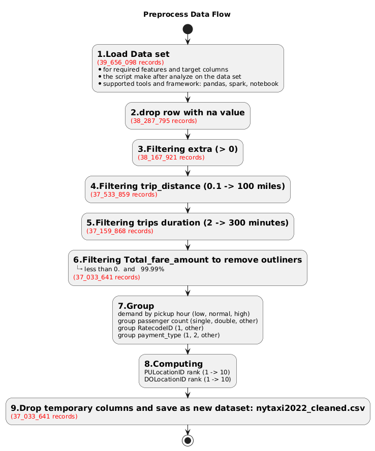

## 2) Model & Training

- **Network:** 1 hidden layer, linear output  
\[
\hat{y} = w_2^\top \,\sigma(W_1 x + b_1) + b_2
\]
- **Loss proxy logged each `eval_every`:** `R(θ_k)` = sampled MAE (fast to compute).
- **Optimizer:** plain SGD (mini-batches). Gradients averaged with `MPI.Allreduce`.
- **MPI** to connect 2 laptop and devide data set into 8 portions; 1st laptopn with Memory of 18 GB will handle 3 processes and 2nd laptop with Memory of 32 GB will handle 5 processes.

---

## 3) Experiment Grid (σ × M) and Results 

Activate MPI in the begining of Training with Process = 8.

Laptop 1 (18 GB) will handle 3 processes and Laptop 2 (32 GB) will handle 5 processes

Laptop 2 (32 GB) is the main one to start and then enable laptop 1 to follow.

Parameters of experiment:
 **3 activations** × **5 batch sizes** at **Process = 8**.  chosen per activation/M:

| Activation | 128 | 256 | 512 | 1024 | 2048 |
|---|---:|---:|---:|---:|---:|
| **ReLU**    | x | x | x | x | x |
| **Tanh**    |  x |  x | x | x | x |
| **Sigmoid** |  x |  x |  x | x | x|

Common settings: `lr=0.002`, `hidden units = 64`, `epochs=1`, `seed=123`

---
**Observations**
- RMSE is at **best** with activation = sigmoid (7.313906 to  8.028142).  
- However, the processing time is highest with sigmoid ( 166.1092s to 169.6367s)
- The **balanced** config considering the outcome of RMSE and processing time is `relu, M=1204` gives competitive RMSE at lowest speed (compared with Sigmoid and Tanh)
- Very large batch (`M=2028`) did not improve much RMSE

**Figures** produced by `z_extract_log_to_csv.ipynb`):basing on "logs" produced via each execution of Train/Test
(*due to limitation of capability of laptop, we did run each Experiment one by one, instead of running with Sweep to make sure the laptop can run smoothly with big dataset)

- **RMSE vs batch size**  
  
  

- **Training time vs batch size**  
  

- **Sample training histories between the value of R(θk) versus k (iter) (at Process rank = 0))**  

    For ReLU ~ experiment with 5 different batch size at epoch=1
  

    
    
    
    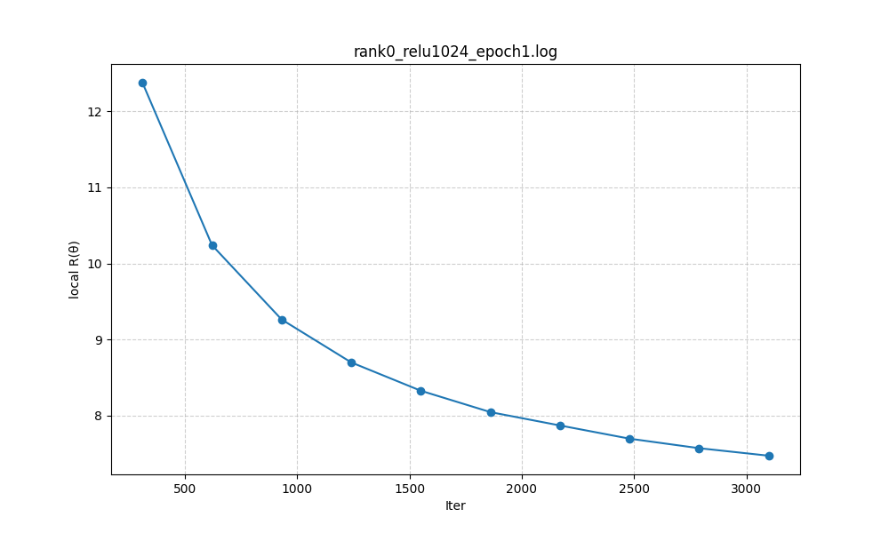
    
  

  

    For Sigmoid  ~ experiment with 5 different batch size at epoch=1

  

    
    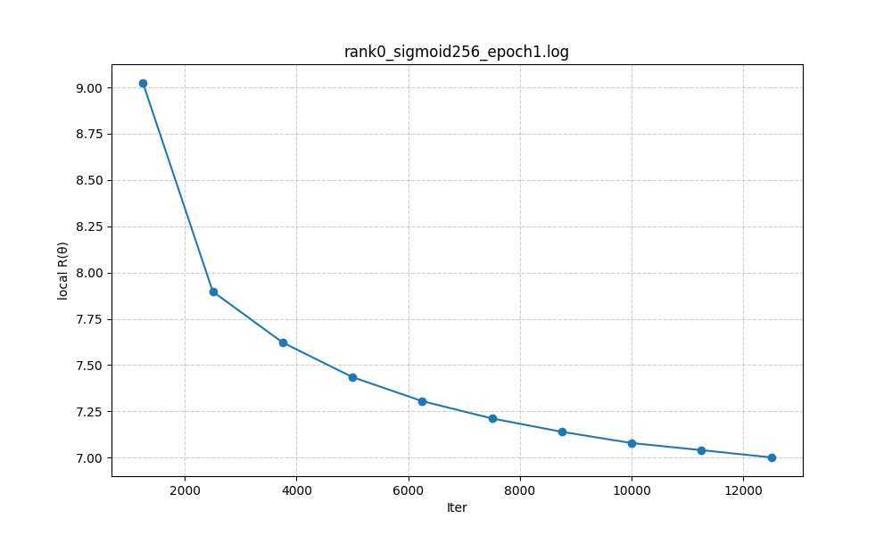
    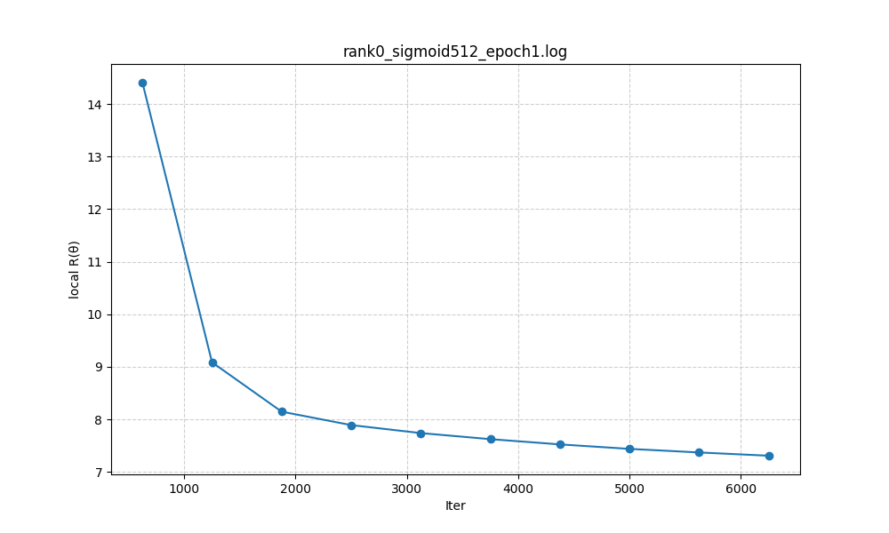
    
    
  

  

    For Tanh  ~ experiment with 5 different batch size at epoch=1
    

    
    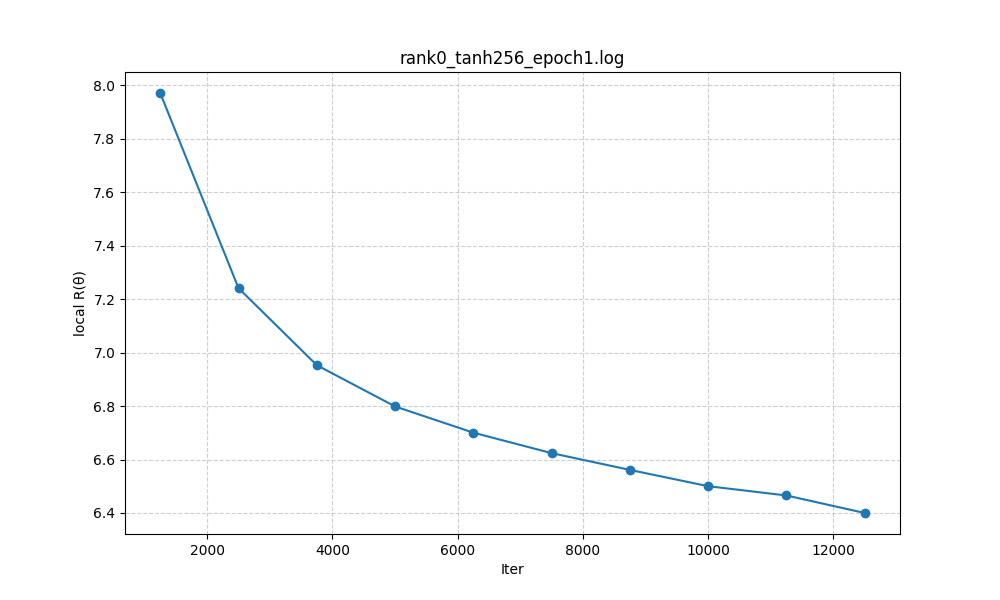
    
    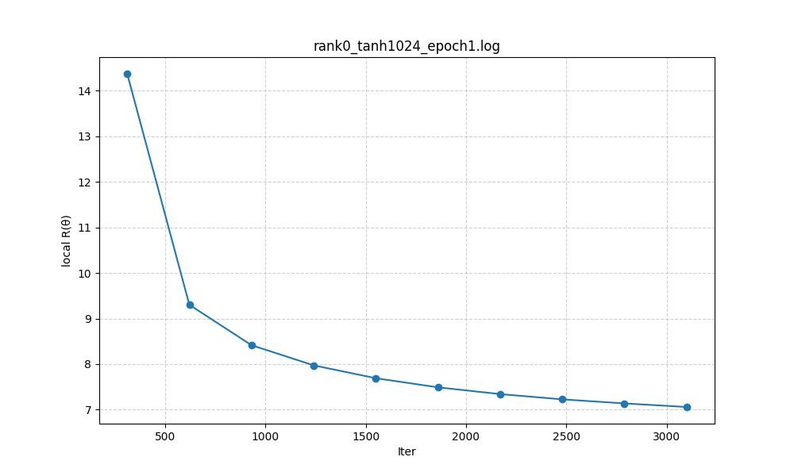
    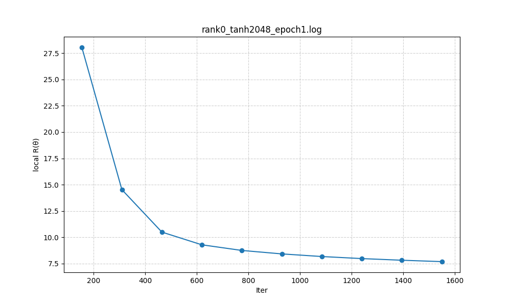
  

  

---
## 4) Training times for different numbers of processes 

experience for ReLU - considering from above experience (3) best combination at config:
- **Activation:** ReLU  
- **Batch size (M):** 1024  
- **Hidden units (n):** 64   
- **epoch:** 1
at different process: 8, 12, 16 

| procs | laptop 1 (18GB) | laptop 2 (32 GB) | 
|-----:|----------------:|--------:|
| 8 | 3 process | 5 process |
| 12 | 5 process | 7 process |
| 16 | 6 process  | 10 process | 

Result:

|Number of Process|global_train_data_size|local_data_sizes|train_time|rmse_train|rmse_test|run_training_time|file name in log                              |
|--------------|-----------------|-----------|----------|----------|---------|-----------------|-----------------------------------|
|12            |25923540         |2160295    |52.995    |18.110921 |18.086124|67.0841          |rank0_relu1024_epoch1_process12.log|
|16            |25923545         |1620222    |54.432    |18.830995 |18.8193  |70.1238          |rank0_relu1024_epoch1_process16.log|
|8             |25923545         |3240444    |67.488    |16.367756 |16.365548|85.3176          |rank0_relu1024_epoch1.log          |

**Obeservation**: 
Seeingg the reducing of training time when increasing number of process (MPI), not much  significant change interm of RMSE_Train or RMSE_Test
---
## 5) Efforts to Improve Results & Performance
---
## Trial 1: Experience the RMSE and Training Time with different epoch = 1 and epoch = 5
Config shown: **ReLU, M=256, n=256**, P ∈ {1,2,4,8}. See `results/scaling_table.csv`.
 
- **Batch size (M):** 1024  
- **Hidden units (n):** 64   
- **process:** 8

| procs | epoch = 1 | epoch = 3 | epoch = 5 |
|-----:|----------------:|--------:|--------:|
| ReLU| x | x | x |
| Sigmoid | x | x | x |
| Tanh | x  | x | x |

**Observation**: when epoch increasing from 1 to 3, then 5, the result below shows the significant reduce of RMSE, which means huge improvement.Time process also increasing, but among 3 activations, with similar outcome of RMSE Train, ReLU requires least data processing time.

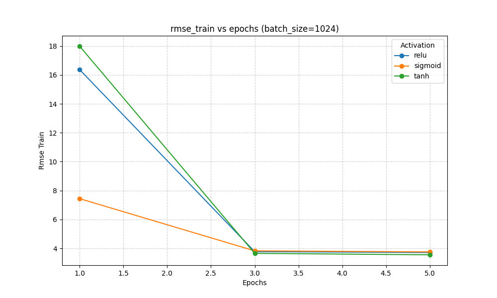
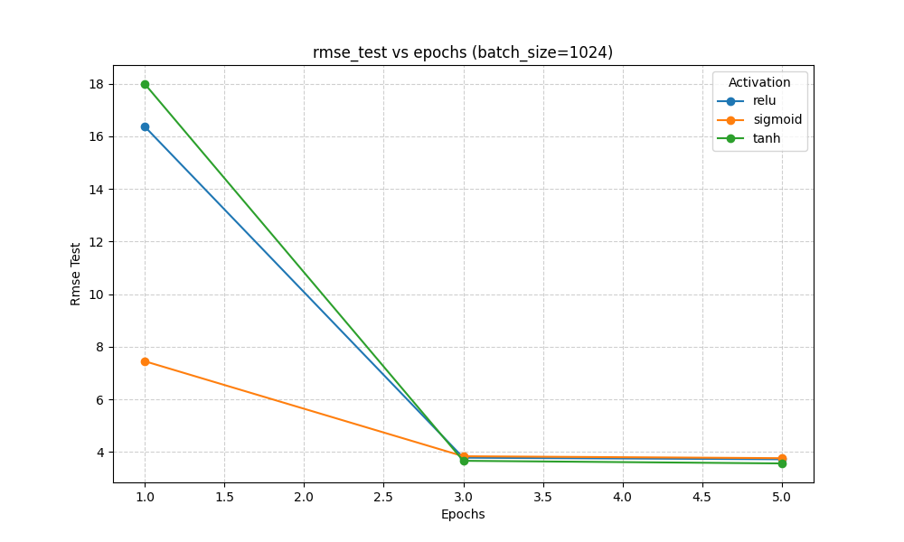
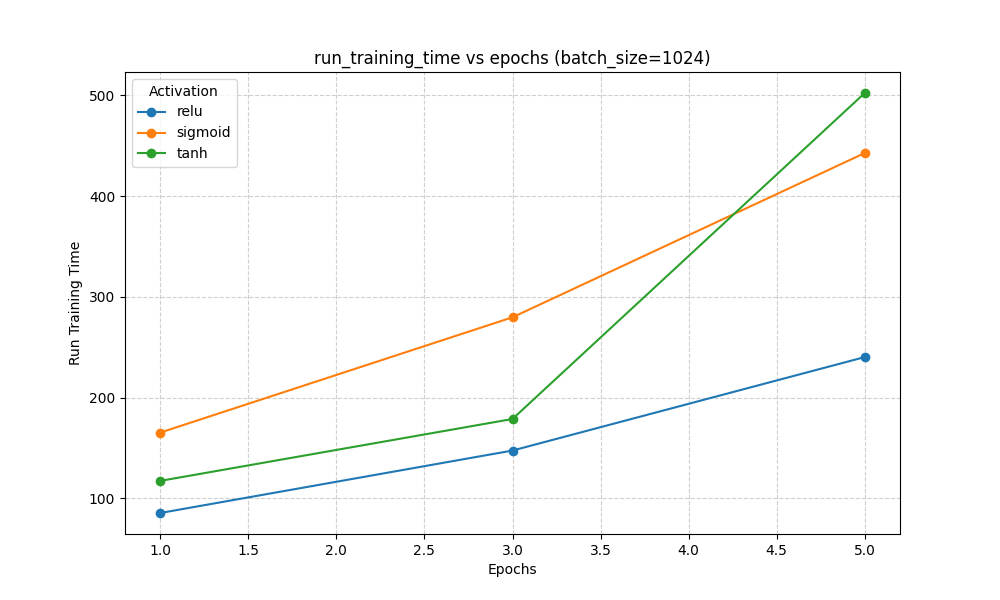

- **Sample training histories between the value of R(θk) versus k (iter) (at Process rank = 0))**  

    For ReLU ~ experiment  at epoch=1. vs at epoch=3 vs at epoch=5
  

    
    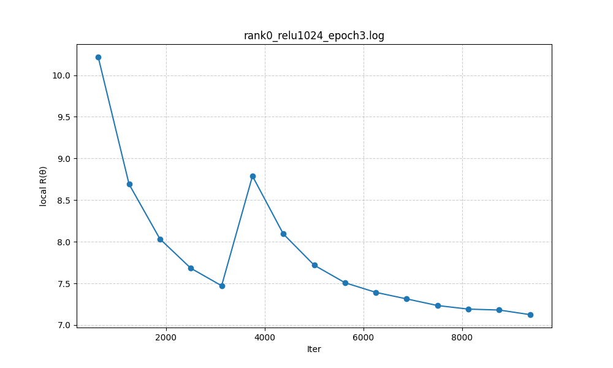
    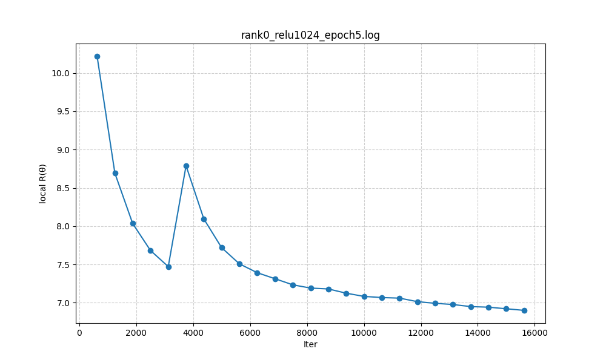
  

  

---

## Trial 2:  Experience to setup the MPI to sync at every 1000 batch, instead of only sync at one time after each process finish

Parameters of experiment:
- **activations**: ReLU
- **batch sizes**: 1024
- **Process**: 8

Common settings: `lr=0.002`, `hidden units = 64`, `epochs=1`, `seed=123`

**Result:**

|sync_every|train_time|rmse_train|rmse_test|run_training_time|file name in logs|
|----------|----------|----------|---------|-----------------|----|
|Synchronize every 1000 batch (within 1 epoch)      |85.395    |3.961258  |3.968538 |104.0165         |rank0_relu1024_epoch1_syncevery1000.log|
|No synchronize during training time (within 1 epoch)        |67.488    |16.367756 |16.365548|85.3176          |rank0_relu1024_epoch1.log|

**Observation:** 

when setup the MPI to sync at every 1000 batch, instead of only sync at one time after each process finish (within 1 epoch), it witnesses a significant improvement of RMSE_Train and RMSE_Test from ~16.36 to ~3.97, but Training time also increases from ~85.32s to ~104.
---
## 7) Summary and limitation

From above outcome and considering the effort to improve the RMSE_Train, **balanced** config is below combination:

- **activations**: ReLU
- **batch sizes**: 1024
- **Process**: 8
- **Epoch**: 3
- **setup the MPI to sync at every 1000 batch**

Common settings: `lr=0.002`, `hidden units = 64`, `seed=123`

