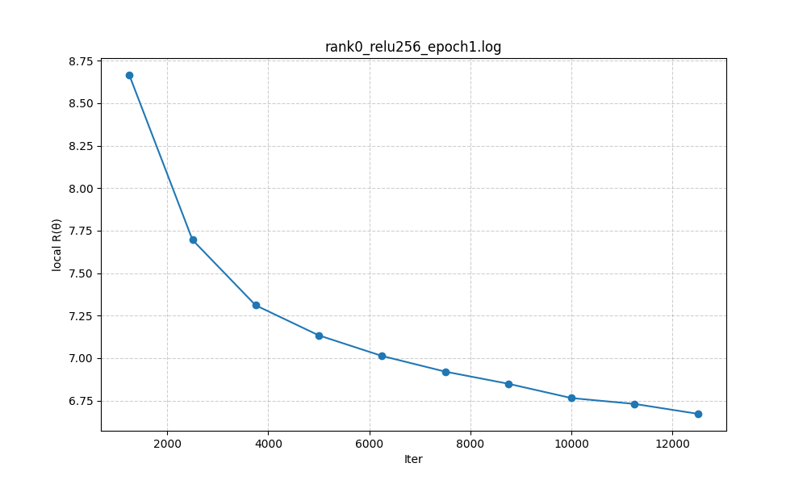

# Project 1 — Distributed Training on NYC Taxi (MPI)

**Course:** DSS5208 – Scalable Distributed Computing for Data Science  
**Goal:** Train a 1-hidden-layer neural network on NYC taxi data using **MPI (mpi4py)**.  
We run three activation functions σ and at five batch sizes M, log training histories, report RMSE on train/test, and training Times for different number of processes 
Data are stored **nearly evenly** across processes via memory-mapped shards.

## 1) Data & Preprocessing

- **Raw:** `nytaxi2022.csv` (not tracked in Git).
- **Cleaned:** `nytaxi2022_cleaned.csv`

Preprocess activities to cleanup and remove outliner from dataset:


## 2) Theory & Algorithm

### 2.1 Model and Loss

We train a 1-hidden-layer neural network for scalar regression (predicting `total_amount`). 
- Inputs $\mathbf{x}\in\mathbb{R}^{m}$, 
- hidden width $H$, 
- activation $\sigma\in{\text{ReLU},\tanh,\text{sigmoid}}$, 
- parameters $\theta={\mathbf{W}_1\in\mathbb{R}^{H\times m},\ \mathbf{b}_1\in\mathbb{R}^{H},\ \mathbf{w}_2\in\mathbb{R}^{H},\ b_2\in\mathbb{R}}$. 

**Forward (single sample):**

$$
\mathbf{z}=\mathbf{W}_1\mathbf{x}+\mathbf{b}_1,\qquad
\mathbf{a}=\sigma(\mathbf{z}),\qquad
\hat{y}=\mathbf{w}_2^{\top}\mathbf{a}+b_2.
$$

**Per-sample loss & empirical risk:**

$$
\ell(\theta;\mathbf{x},y)=\tfrac{1}{2}(\hat{y}-y)^2,\qquad
R(\theta)=\frac{1}{N}\sum_{i=1}^{N}\ell(\theta;\mathbf{x}_i,y_i).
$$

**RMSE on a set $\mathcal{S}$:**

$$
\mathrm{RMSE}=\sqrt{\frac{1}{|\mathcal{S}|}\sum_{(\mathbf{x},y)\in\mathcal{S}}\bigl(\hat{y}-y\bigr)^2}.
$$

We **log** $R(\theta_k)$ vs iteration (k) at **epoch end** using a **global** SSE Allreduce (see §2.7). Final RMSE (train/test) is computed **globally**. 

---

### 2.2 Activations and Derivatives (elementwise)
```math

\textbf{ReLU: }\ \sigma(z)=\max(0,z),\ \ \sigma'(z)=\mathbf{1}[z>0];\qquad
\textbf{Sigmoid: }\ \sigma(z)=\frac{1}{1+e^{-z}},\ \ \sigma'(z)=\sigma(z)\bigl(1-\sigma(z)\bigr);
\textbf{Tanh: }\ \sigma(z)=\tanh(z),\ \ \sigma'(z)=1-\tanh^2(z).
```
(These are implemented explicitly.) 

---

### 2.3 Gradients (single sample)

Let $e=\hat{y}-y$. Then
```math
\begin{aligned}
\frac{\partial \ell}{\partial \hat{y}}&=e,\qquad
\frac{\partial \ell}{\partial \mathbf{w}_2}=e\mathbf{a}^{\top},\qquad
\frac{\partial \ell}{\partial b_2}=e,\\
\\
\frac{\partial \ell}{\partial \mathbf{a}}&=e\mathbf{w}_2,\qquad
\frac{\partial \ell}{\partial \mathbf{z}}=\bigl(e\mathbf{w}_2\bigr)\odot\sigma'(\mathbf{z}),\\
\\
\frac{\partial \ell}{\partial \mathbf{W}_1}&=\bigl(\bigl(e\mathbf{w}_2\bigr)\odot\sigma'(\mathbf{z})\bigr)\mathbf{x}^{\top},\qquad
\frac{\partial \ell}{\partial \mathbf{b}_1}=\bigl(e\mathbf{w}_2\bigr)\odot\sigma'(\mathbf{z}).
\end{aligned}
```

The implementation averages batch gradients by dividing by (B) inside `backward`. 

---

### 2.4 Vectorized Mini-Batch ($B$ samples)

Stack $\mathbf{X}\in\mathbb{R}^{B\times m},\ \mathbf{y}\in\mathbb{R}^{B}$.

$$
\mathbf{Z}=\mathbf{X}\mathbf{W}_1^{\top}+\mathbf{1}\mathbf{b}_1^{\top},\quad
\mathbf{A}=\sigma(\mathbf{Z}),\quad
\hat{\mathbf{y}}=\mathbf{A}\mathbf{w}_2+b_2\mathbf{1}.
$$
Let $\mathbf{e}=\hat{\mathbf{y}}-\mathbf{y}$, 
$$
\mathbf{G}_Z=(\mathbf{e}\mathbf{w}_2^{\top})\odot\sigma'(\mathbf{Z}).
$$
Averaging over the batch:
$$
\frac{1}{B}\frac{\partial \ell}{\partial \mathbf{w}_2}=\frac{1}{B}\mathbf{A}^{\top}\mathbf{e},\quad
\frac{1}{B}\frac{\partial \ell}{\partial b_2}=\frac{1}{B}\mathbf{1}^{\top}\mathbf{e},\\
\\
\frac{1}{B}\frac{\partial \ell}{\partial \mathbf{W}_1}=\frac{1}{B}\mathbf{X}^{\top}\mathbf{G}_Z,\quad
\frac{1}{B}\frac{\partial \ell}{\partial \mathbf{b}_1}=\frac{1}{B}\mathbf{1}^{\top}\mathbf{G}_Z.
$$

The code implements the same vectorized forms and then flattens to a single parameter vector for updates. 

---

### 2.5 Data Distribution & Normalization (as implemented)

* **Even storage / loading.** Before training, the raw CSV is split into `to_{P}/part_{rank}.csv`. Each rank (p) **reads only its shard**:
  `args.data/to_{size}/part_{rank}.csv`. This meets the **“stored nearly evenly”** requirement and avoids broadcasting the whole dataset. 
* **Train/test split.** Each rank performs a local 70/30 split using a fixed RNG. 
* **Feature scaling only.** Rank 0 computes **feature** means/std from its **local** train subset, broadcasts ${\mu_j,\sigma_j}$ and the list of feature columns to all ranks, and each rank standardizes its local train/test features using those values. The **target is not standardized**. (This assumes i.i.d. shards so rank 0’s stats approximate global.) 

---

### 2.6 Local-SGD with **Periodic Parameter Averaging**

Each rank runs mini-batch SGD **locally** and periodically performs an **Allreduce over the parameter vector** (sum, then divide by (P)):

* If `--sync-every > 0`: average **every (K)** batches.
* If `--sync-every  = 0`: average **once at epoch end**.

**Per-batch step on rank (p):**

1. Sample local batch $(\mathbf{X}_p,\mathbf{y}_p)$.
2. Forward → compute $\hat{\mathbf{y}}$, loss.
3. Backward → batch-averaged gradient vector $\mathbf{g}_p$.
4. Local update: $\theta_p \leftarrow \theta_p - \eta,\mathbf{g}_p$.
5. If it’s a sync step: Allreduce on the **parameter vector** and set $\theta_p \leftarrow \frac{1}{P}\sum_{q}\theta_q$.

Formally, after $K$ local steps,

$$
\theta_p \leftarrow \theta_p - \eta\sum_{k=1}^{K}\mathbf{g}^{(k)}*{p},\qquad
\theta \leftarrow \frac{1}{P}\sum*{p=0}^{P-1}\theta_p
\quad \text{(parameter Allreduce/average)}.
$$

This reduces communication (only every $K$ steps) at the cost of **model drift**; accuracy depends on $K$ and $\eta$. The code implements parameter flattening and `Allreduce` for this averaging. 

---

### 2.7 Objective Logging and Final Metrics

* **Epoch-end $R(\theta)$.** Each rank computes local SSE on its full **local** train set; ranks sum SSE via `Allreduce`, then
  
$$ R(\theta_k) = \frac{1}{2N}\mathrm{SSE}_{\text{global}}. $$
  
  This global value is logged once per epoch. (There is also an optional **local** $R(\theta)$ print every `print_every` steps for debugging.) 
* **Final RMSE (global).** Train/test SSE are computed **locally** and then **summed** via `Allreduce`, divided by global counts, and square-rooted:
  
$$
  \mathrm{RMSE}{\text{train}}=\sqrt{\frac{\sum_p \mathrm{SSE}{p,\text{train}}}{\sum_p N_{p,\text{train}}}},\qquad
  \mathrm{RMSE}{\text{test}}=\sqrt{\frac{\sum_p \mathrm{SSE}{p,\text{test}}}{\sum_p N_{p,\text{test}}}}.
$$

  (Units are USD because the target is not standardized.) 

---

### 2.8 Complexity & Communication

Let $S=\lvert\theta\rvert = Hm + H + H + 1$ be parameter count.

* **Compute per batch per rank:** $O(B,m,H)$ forward + $O(B,m,H)$ backward (dominant).
* **Communication (parameter averaging):** one Allreduce on (S) floats **every $K$ batches**:
  $\approx \alpha\log P + \beta,S\log P$ per Allreduce $latency (\alpha), per-byte (\beta)$.
* Larger $K$ → fewer comms (higher throughput), but greater drift; smaller $K$ → closer to fully synchronous behavior.

---

### 2.9 Practical Hyperparameters

From the CLI: `--epochs` (default 1), `--batch-size` (default 1024), `--hidden` (default 64), `--lr` (default 0.002), `--activation` (`relu|tanh|sigmoid`), `--seed` (123), `--sync-every` (0 = epoch-end), `--print-every` (2500), `--save-model` (directory). These map directly to the training loop above. 

---

**Notes & Assumptions:**

* Data shards: each rank reads `.../to_{P}/part_{rank}.csv` (nearly even rows). 
* Feature scaling only (target not standardized); stats computed on **rank 0’s train shard** and broadcast to all ranks (assumes i.i.d. across shards). 
* Local-SGD with periodic **parameter** Allreduce; epoch-end global $R(\theta)$; final global RMSE via SSE Allreduce. 

---


Model Explaination as below flowchart:


---

## 3) Experiment Grid (σ × M) and Results 

Activate MPI in the begining of Training with Process = 8.

Laptop 1 (18 GB) will handle 3 processes and Laptop 2 (32 GB) will handle 5 processes

Laptop 2 (32 GB) is the main one to start and then enable laptop 1 to follow.

Parameters of experiment:
 **3 activations** × **5 batch sizes** at **Process = 8**.  chosen per activation/M:

| Activation | 128 | 256 | 512 | 1024 | 2048 |
|---|---:|---:|---:|---:|---:|
| **ReLU**    | x | x | x | x | x |
| **Tanh**    |  x |  x | x | x | x |
| **Sigmoid** |  x |  x |  x | x | x|

Common settings: `lr=0.002`, `hidden units = 64`, `epochs=1`, `seed=123`

---
**Observations**
- RMSE is at **best** with activation = sigmoid (7.313906 to  8.028142).  
- However, the processing time is highest with sigmoid ( 166.1092s to 169.6367s)
- The **balanced** config considering the outcome of RMSE and processing time is `relu, M=1204` gives competitive RMSE at lowest speed (compared with Sigmoid and Tanh)
- Very large batch (`M=2028`) did not improve much RMSE

**Figures** produced by `z_extract_log_to_csv.ipynb`):basing on "logs" produced via each execution of Train/Test
(*due to limitation of capability of laptop, we did run each Experiment one by one, instead of running with Sweep to make sure the laptop can run smoothly with big dataset)

- **RMSE vs batch size**  
  
  
In this graph, ReLU and Sigmoid exhibit similar trend, where the RSME decrease as batch size increase, at a decreasing rate. While Tanh RSME increased as batch size increases. 
Activation Function Properties & Optimization:
- Tanh (Hyperbolic Tangent): tanh(x) = (e^x - e^-x) / (e^x + e^-x). It outputs values between -1 and 1. Its derivative (1 - tanh(x)^2) is close to 0 for large positive or negative inputs (the "saturation" problem). This can lead to vanishing gradients, making it harder for the network to learn, especially if weights become too large during training.
- ReLU (Rectified Linear Unit): ReLU(x) = max(0, x). It outputs 0 for negative inputs and x for positive inputs. Its derivative is 0 for negative inputs and 1 for positive inputs. It doesn't suffer from vanishing gradients for positive inputs and is computationally very efficient.
- Sigmoid: sigmoid(x) = 1 / (1 + e^-x). It outputs values between 0 and 1. Like Tanh, its derivative (sigmoid(x) * (1 - sigmoid(x))) is close to 0 for large positive or negative inputs, leading to vanishing gradients.

Tanh requires more frequent weight update, and large batches means averaging over thousands of samples before updating, causing the weights to move minimally, and stuck near 0 outputs, resulting in incorrect predictions. 

ReLU outputs are 0 (off) or linear(on), so that even a large batch can move weights enough to activate neurons. 
Sigmoid outputs around 0.5 at initialization, similar to predicting the mean, and thus resulting the low RMSE, and does not depend a lot on the updates in the first epoch.

RMSE tapers means model keeps improving with larger batch size. 

- **Training time vs batch size**  
  

- **Sample training histories between the value of R(θk) versus k (iter) (at Process rank = 0))**  
Since the dataset is distributed across multiple MPI processes, each process has its own local view of the data and calculates gradients based on its local mini-batches.Rank 0 reflects the state of the model after the parameter updates have been synchronized across all processes (using MPI.Allreduce). Therefore, it represents the global model's performance as seen from the perspective of rank 0.

    For ReLU ~ experiment with 5 different batch size at epoch=1
  <div>
    
    
    
    
    
  <div>
  </div>
    A decreasing curve indicates that the model is learning: as iterations progress, the loss function of the sampled data points is getting smaller, meaning the predictions are becoming more accurate. The initial step drop indicated rapid learning in the early iterations. 

    For Sigmoid  ~ experiment with 5 different batch size at epoch=1

  <div>
    
    
    
    
    
  <div>
  </div>

    For Tanh  ~ experiment with 5 different batch size at epoch=1
  <div>
    
    
    
    
    
  <div>
  </div>
---
## 4) Training times for different numbers of processes 

experience for ReLU - considering from above experience (3) best combination at config:
- **Activation:** ReLU  
- **Batch size (M):** 1024  
- **Hidden units (n):** 64   
- **epoch:** 1
at different process: 8, 12, 16 

| procs | laptop 1 (18GB) | laptop 2 (32 GB) | 
|-----:|----------------:|--------:|
| 8 | 3 process | 5 process |
| 12 | 5 process | 7 process |
| 16 | 6 process  | 10 process | 

Result:

|Number of Process|global_train_data_size|local_data_sizes|train_time|rmse_train|rmse_test|run_training_time|file name in log                              |
|--------------|-----------------|-----------|----------|----------|---------|-----------------|-----------------------------------|
|12            |25923540         |2160295    |52.995    |18.110921 |18.086124|67.0841          |rank0_relu1024_epoch1_process12.log|
|16            |25923545         |1620222    |54.432    |18.830995 |18.8193  |70.1238          |rank0_relu1024_epoch1_process16.log|
|8             |25923545         |3240444    |67.488    |16.367756 |16.365548|85.3176          |rank0_relu1024_epoch1.log          |

**Obeservation**: 
Seeingg the reducing of training time when increasing number of process (MPI), not much  significant change interm of RMSE_Train or RMSE_Test
---
## 5) Efforts to Improve Results & Performance
---
## Trial 1: Experience the RMSE and Training Time with different epoch = 1 and epoch = 5
Config shown: **ReLU, M=256, n=256**, P ∈ {1,2,4,8}. See `results/scaling_table.csv`.
 
- **Batch size (M):** 1024  
- **Hidden units (n):** 64   
- **process:** 8

| procs | epoch = 1 | epoch = 3 | epoch = 5 |
|-----:|----------------:|--------:|--------:|
| ReLU| x | x | x |
| Sigmoid | x | x | x |
| Tanh | x  | x | x |


**Observation**: when epoch increasing from 1 to 3, then 5, the result below shows the significant reduce of RMSE, which means huge improvement.Time process also increasing, but among 3 activations, with similar outcome of RMSE Train, ReLU requires least data processing time.


Sigmoid gives the lowest RMSE as the model output starts near the mean. At initialization, network weights are small values thar are close to 0, and when the inputs multiplied by the small weights will cause most neurons output to be around 0.5, which means the model's initial predictions are almost constant, which is the mean. As training continues, Sigmoid units will saturate due to vanishing gradient during back propagation, where the ability to improve is limited. 

ReLU and Tanh, on the other hand, will reduce RMSE much further once neurons are activated. The sharp drop means the model has capacity to fit the training data well. 

This shows that the initial Sigmiid advantage disappeared quickly at 3 epoch. 

Training time grows with epoch, with ReLU the fastest as it is the only activation function that does not need exponetial. As ReLU is f(z)=max(0,z), there is only 1 comparison needed where if z > 0: return z else: return 0. Exponential functions are non linear and will add on to processing time when epochs increase. 

- **Sample training histories between the value of R(θk) versus k (iter) (at Process rank = 0))**  

    For ReLU ~ experiment  at epoch=1. vs at epoch=3 vs at epoch=5
  <div>
    
    
    
  <div>
  </div>
---

## Trial 2:  Experience to setup the MPI to sync at every 1000 batch, instead of only sync at one time after each process finish

Parameters of experiment:
- **activations**: ReLU
- **batch sizes**: 1024
- **Process**: 8

Common settings: `lr=0.002`, `hidden units = 64`, `epochs=1`, `seed=123`

**Result:**

|sync_every|train_time|rmse_train|rmse_test|run_training_time|file name in logs|
|----------|----------|----------|---------|-----------------|----|
|Synchronize every 1000 batch (within 1 epoch)      |85.395    |3.961258  |3.968538 |104.0165         |rank0_relu1024_epoch1_syncevery1000.log|
|No synchronize during training time (within 1 epoch)        |67.488    |16.367756 |16.365548|85.3176          |rank0_relu1024_epoch1.log|

**Observation:** 

when setup the MPI to sync at every 1000 batch, instead of only sync at one time after each process finish (within 1 epoch), it witnesses a significant improvement of RMSE_Train and RMSE_Test from ~16.36 to ~3.97, but Training time also increases from ~85.32s to ~104.
---
## 7) Summary and limitation

From above outcome and considering the effort to improve the RMSE_Train, **balanced** config is below combination:

- **activations**: ReLU
- **batch sizes**: 1024
- **Process**: 8
- **Epoch**: 3
- **setup the MPI to sync at every 1000 batch**

Common settings: `lr=0.002`, `hidden units = 64`, `seed=123`

